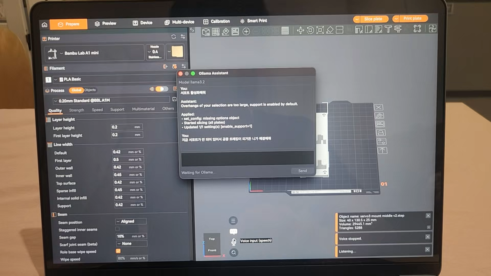

<p align="center">
  
</p>

# VerSlicer

### AI-Powered 3D Printing Slicer

> OrcaSlicer fork with a local Ollama assistant — natural language and voice on macOS.

<p align="center">
  
</p>

<p align="center">
  <video src="docs/test.mp4" width="900" controls>
    <a href="docs/test.mp4">Watch demo (MP4)</a>
  </video>
</p>

**VerSlicer** is an AI-powered 3D printing slicer built on [OrcaSlicer](https://github.com/SoftFever/OrcaSlicer).

It keeps OrcaSlicer’s slicing workflow (presets, multi-plate, preview, Bambu Lab network/cloud/Device tab) and adds a **local** [Ollama](https://ollama.com/) assistant in the 3D view. You describe what you want in plain language; the model returns structured actions (change layer height, rotate a part, slice, and so on) that VerSlicer runs for you. No cloud API key for the AI part — it talks to Ollama on your machine.

macOS builds only for now.

## Why VerSlicer?

- Control the slicer with **natural language** instead of hunting through every setting
- **Local AI** via Ollama — your prompts and context stay on your Mac
- **Voice** workflow on macOS (toolbar → chat)
- **Compatible** with existing OrcaSlicer print/filament/printer presets
- **Bambu Lab** workflow (network plugin, cloud, Smart Print UI) carried over from the Orca base

## What it does

- Floating **Ollama chat** on the plater toolbar (plus voice on macOS)
- Sends plate/preset context to the model; expects one JSON reply with an `actions` list
- Implementation: [`src/slic3r/GUI/OllamaAssistant/`](src/slic3r/GUI/OllamaAssistant/)

### Ollama setup

Install [Ollama](https://ollama.com/), pull a model, leave it running. Defaults in the chat panel: `llama3.2` at `http://127.0.0.1:11434`.

```bash
ollama pull llama3.2
```

Open **Ollama chat** from the 3D toolbar. Supported action types include `set_config`, `ui_select_tab`, `slice`, `translate` / `rotate` / `scale`, `delete_selection`, `clone_selection`, `arrange`, `add_model`, `menu_item`.

## Build (developers)

macOS 11.3+, Xcode or CLT, CMake 3.13+. Ninja recommended (`-x`).

```bash
./build_release_macos.sh       # deps + app
./build_release_macos.sh -x    # Ninja multi-config
./build_release_macos.sh -s    # app only
./build_release_macos.sh -h
```

Output: `build/<arch>/`. DMG: `./build_release_macos.sh -s -x -M`.

## License & copyright

VerSlicer is developed based on OrcaSlicer.

OrcaSlicer and related upstream code remain under their original open-source licenses; copyright belongs to the upstream authors.

Additional features, UI improvements, and AI-related functionality in VerSlicer are copyright **Lee Hee Seung**. See [LICENSE](LICENSE).

## Links

- [OrcaSlicer](https://github.com/SoftFever/OrcaSlicer)
- [Ollama](https://ollama.com/) · [API docs](https://github.com/ollama/ollama/blob/main/docs/api.md)
