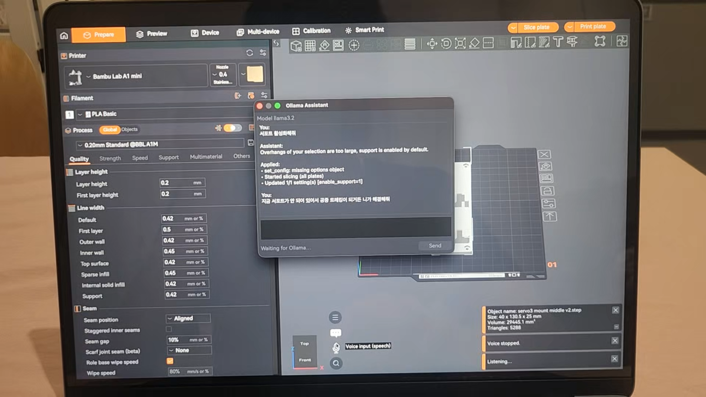

<p align="center">
  
</p>

# VerSlicer

### AI-Powered 3D Printing Slicer

> [OrcaSlicer](https://github.com/SoftFever/OrcaSlicer) fork with [Ollama](https://ollama.com/) on your Mac — chat and voice

<p align="center">
  
</p>

## Demo

<p align="center">
  <video src="docs/test.mp4" width="900" controls playsinline poster="docs/images/main-ui.png">
    <a href="docs/test.mp4"></a>
  </video>
</p>

<p align="center">
  <a href="docs/test.mp4"><strong>Watch demo (MP4)</strong></a>
</p>

**VerSlicer** starts from OrcaSlicer and adds an assistant that can change the slicer for you — presets, parts on the bed, slice, and the usual menus — from a chat window on the 3D view.

Type what you want, or use the mic on macOS. Ollama runs locally; the app turns the reply into real steps. No separate “advisor” window that only talks: it uses the same plater you already have.

Bambu network plugin, cloud, Device tab, and Smart Print are still there. Builds are **macOS-only** right now.

## Setup

### 1. Install Ollama and pull the default model

```bash
ollama pull qwen2.5:3b
```

Install [Ollama](https://ollama.com/), leave it running (`ollama serve` or the menu-bar app), then open VerSlicer and **Ollama chat** on the 3D toolbar.

**Default model:** `qwen2.5:3b` — tuned for fast replies on Apple Silicon. For higher quality (slower), use `qwen2.5:7b` in the chat panel or in config (see below).

### 2. First launch

1. Open VerSlicer → 3D view → **Ollama chat**
2. Set **Mode** to **Apply** to change slicer settings from chat
3. Confirm the model label shows `qwen2.5:3b`

### 3. Voice (macOS)

- Grant **Microphone** and **Speech Recognition** when prompted
- For Korean voice, add Korean in **System Settings → General → Language & Region** (above English if you speak Korean)
- Speak clearly; garbled transcripts are rejected instead of being sent to the model

## AI assistant defaults

| Setting | Default | Notes |
| --- | --- | --- |
| Model | `qwen2.5:3b` | `qwen2.5:7b` still works if installed |
| Context window | 8192 tokens | Smaller = faster |
| Max reply tokens | 768 | Enough for JSON actions |
| Keep-alive | 30 min | Avoids reload delay between messages |
| Two-hop planner | off | Single LLM call = faster |
| Keyword inject | on | Reliable fixes for stringing, brim, support, etc. |
| Wiki search / critic | off | Enable for harder troubleshooting |

Stored in `~/Library/Application Support/verslicer/verslicer.conf` under `"ollama"`:

```json
"ollama": {
  "model": "qwen2.5:3b",
  "assistant_mode": true,
  "keyword_inject": "true",
  "two_hop": "false",
  "wiki_search": "false",
  "critic": "false"
}
```

Environment overrides: `OLLAMA_TWO_HOP`, `OLLAMA_KEYWORD_INJECT`, `OLLAMA_WIKI_SEARCH`, `OLLAMA_CRITIC` (`1` / `true` / `on`).

## Build

macOS 11.3+, Xcode or CLT, CMake 3.13+.

```bash
./build_release_macos.sh       # deps + app
./build_release_macos.sh -x    # Ninja, nicer for dev
./build_release_macos.sh -s    # app only (after deps are built)
```

Output: `build/<arch>/src/Release/verslicer.app`  
Symlink: `build/<arch>/OrcaSlicer/Verslicer.app`

Quick rebuild after code changes:

```bash
cd build/arm64
cmake --build . --config Release --target OrcaSlicer -j$(sysctl -n hw.ncpu)
open src/Release/verslicer.app
```

## Installer (DMG)

Package an existing Release build for another Mac (no dev tools required):

```bash
./scripts/make_macos_installer.sh          # package existing build
./scripts/make_macos_installer.sh --build  # rebuild app, then package
./build_release_macos.sh -s -x -M          # same as --build + .dmg
```

**Output:** `build/<arch>/dist/VerSlicer-macOS-<arch>-<version>.dmg`  
Example: `build/arm64/dist/VerSlicer-macOS-arm64-3.0.0.dmg`

**On another Mac:**

1. Open the DMG → drag **VerSlicer** to **Applications**
2. Install [Ollama](https://ollama.com/download) and run `ollama pull qwen2.5:3b`
3. If macOS blocks the app (unsigned build): **Right-click → Open** once, or:
   ```bash
   xattr -dr com.apple.quarantine /Applications/VerSlicer.app
   ```

Optional signing & notarization: set `APPLE_SIGNING_IDENTITY`, `APPLE_ID`, `APPLE_TEAM_ID`, `APPLE_APP_PASSWORD` before running `make_macos_installer.sh` (see `scripts/package_macos_dmg.sh`).

## Where this is going

Right now the assistant is good at everyday plate and preset work — tune, orient, slice — without treating the slicer like a settings encyclopedia.

Later I want to go further (e.g. helping when prints fail, from logs).

## License & copyright

VerSlicer is developed based on OrcaSlicer.

OrcaSlicer and related upstream code remain under their original open-source licenses; copyright belongs to the upstream authors.

Additional features, UI improvements, and AI-related functionality in VerSlicer are copyright **Lee Hee Seung**. See [LICENSE](LICENSE).

## Links

- [OrcaSlicer](https://github.com/SoftFever/OrcaSlicer)
- [Ollama](https://ollama.com/) · [API docs](https://github.com/ollama/ollama/blob/main/docs/api.md)
