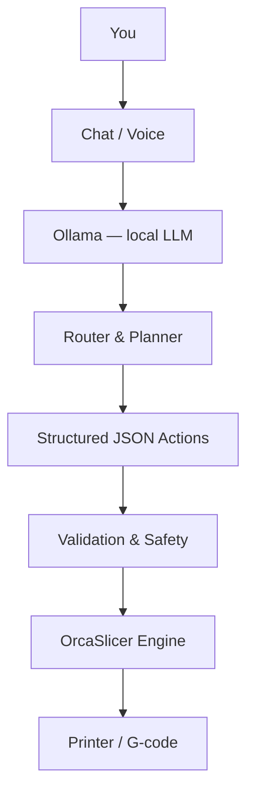

<p align="center">
  
</p>

<h1 align="center">VerSlicer</h1>

<p align="center">
  <strong>Just describe what you want. VerSlicer handles the rest.</strong><br/>
  Turn natural language into real slicing actions — on your Mac, with your printer, locally.
</p>

<p align="center">
  An <a href="https://github.com/SoftFever/OrcaSlicer">OrcaSlicer</a> fork with a built-in <a href="https://ollama.com/">Ollama</a> assistant
</p>

<p align="center">
  
</p>

---

**Instead of learning hundreds of slicer settings, just describe what you want.**

VerSlicer is a full OrcaSlicer build plus a local AI layer that understands your intent — in chat or by voice — and turns it into structured actions on the same plater you already use. Rotate a part, stiffen a print, find a model on MakerWorld, slice, and send to the printer. No separate “advisor” window that only talks.

> **macOS only** for now · **Local-first** — Ollama runs on your machine · Inherits **all OrcaSlicer printer profiles and slicing engine**

# From intent to print

```
  "Make this stronger."
           │
           ▼
   AI understands intent
           │
           ▼
   Automatically adjusts
   infill · walls · supports
   speed · temperature · …
           │
           ▼
      Ready to print
```

Same idea for geometry (“rotate 45°”), acquisition (“print me a vase”), or quality (“layers look stringy”) — you state the goal; VerSlicer picks the route and applies real changes.

# Why VerSlicer?

| OrcaSlicer | VerSlicer |
| --- | --- |
| You learn and tune hundreds of parameters | You describe the outcome you want |
| Expert knowledge in your head or the wiki | Context, wiki excerpts, and presets fed to a local model |
| Manual search → import → configure → slice | **Find & print** from one chat panel when the plate is empty |
| Same great slicing engine | **Same engine** — plus chat, voice, and guarded AI actions |

VerSlicer does not replace Orca’s precision. It removes the gap between *what you mean* and *what the slicer does*.

# How it works


```mermaid
flowchart TD
    U[You] --> C[Chat / Voice]
    C --> O[Ollama — local LLM]
    O --> R[Router & Planner]
    R --> A[Structured JSON Actions]
    A --> V[Validation & Safety]
    V --> E[OrcaSlicer Engine]
    E --> P[Printer / G-code]
```

**Typical Assist path**

1. **You** type or speak on the 3D view chat panel.
2. **Router** classifies the request (single-shot, multi-step assist loop, diagnostic pipeline, or find-and-print orchestrator).
3. **Ollama** returns a short message plus a list of typed actions — never raw G-code rewrites from hallucination.
4. **Validator** checks action types, parameters, and preset keys against a fixed registry.
5. **Executor** applies changes on the live plater (presets, transforms, slice, send, MakerWorld, etc.).

# Main features

- **Natural-language control** — Presets, plate layout, mesh ops, slice, export, and send through Assist mode.
- **Question mode** — Explanations only; nothing on the plate changes.
- **Find & print** — Empty plate + “print me a dragon” / “용 피규어 출력해줘” → MakerWorld search → pick dialog → import → mesh check → auto-config → slice → optional send.
- **Voice (macOS)** — Mic input with garbled-transcript rejection.
- **Print-quality diagnostics** — Symptom → Wiki evidence → current-setting analysis → `set_config` proposal.
- **Rollback** — `rollback_apply` undoes the last AI settings apply.
- **Full OrcaSlicer** — Calibration, seams, network printers, Bambu plugin, Smart Print, and the rest of the Orca feature set.

# Demo

<p align="center">
  <video src="docs/test.mp4" width="900" controls playsinline poster="docs/images/main-ui.png">
    <a href="docs/test.mp4"></a>
  </video>
</p>

<p align="center">
  <a href="docs/test.mp4"><strong>Watch demo (MP4)</strong></a>
</p>

# Getting started

## 1. Install Ollama and pull a model

```bash
ollama pull qwen2.5:3b    # fast on Apple Silicon (recommended to start)
ollama pull qwen2.5:7b    # higher quality, more VRAM/RAM
```

Install [Ollama](https://ollama.com/), keep it running, then open VerSlicer → **AI assistant** on the 3D toolbar.

## 2. First session

1. Set **Mode** to **Assist** to allow real changes.
2. Confirm a model appears in the model dropdown.
3. Try: *“Increase infill to 30%”* or *“Make this stronger.”*

## 3. Chat modes

| Mode | Behavior |
| --- | --- |
| **Question** | Advice only |
| **Assist** | Applies validated actions on the slicer |

## 4. Find and print

When the plate is empty, name what you want printed. The **print job orchestrator** runs: MakerWorld search → thumbnail pick dialog (10 s auto-pick on top hit; keys `1`–`3`) → import → mesh health → auto-config → slice → estimate → optional send. Progress shows in the chat pipeline strip.

## 5. Voice (macOS)

Allow Microphone and Speech Recognition. For Korean, add Korean in **System Settings → General → Language & Region** above English if needed.

---

# AI architecture

| Layer | Role |
| --- | --- |
| **Chat / Voice UI** | `OllamaChatPanel` — modes, streaming, pipeline stepper, MakerWorld offer dialog |
| **Send router** | Deterministic pre-router for acquisition intent (“화분 출력해줘”) before LLM |
| **Assist loop** | Multi-step agent: observe → plan → act (up to 8 steps) |
| **Diagnostic pipeline** | 4-step quality flow with Bambu Lab Wiki prefetch |
| **Print job orchestrator** | End-to-end find → import → slice → send with UI adapter |
| **Action executor** | Maps JSON actions to real `Plater` / preset / network calls |
| **OrcaSlicer core** | Unchanged slicing, profiles, and device stack |

**Request routing (Assist)**

| Route | When |
| --- | --- |
| Print job orchestrator | Empty plate + named object to print |
| Assist loop | Multi-step or tool-heavy goals |
| Diagnostic pipeline | Vague print-quality complaints |
| Two-hop planner | Deep setting changes (optional, off by default) |
| Single-shot | Simple geometry or explicit numbers |

# JSON action format

The model replies with **one JSON object** — not free-form shell commands:

```json
{
  "message": "I'll stiffen the part with more walls and higher infill.",
  "actions": [
    {
      "type": "set_config",
      "preset": "print",
      "options": { "sparse_infill_density": "30%", "wall_loops": 4 }
    }
  ]
}
```

Agent loop variant (multi-step):

```json
{
  "message": "Checking the plate first…",
  "done": false,
  "actions": [{ "type": "get_state" }]
}
```

**Common action types:** `set_config`, `rotate`, `translate`, `scale`, `arrange`, `slice`, `send_print`, `makerworld_find_and_print`, `import_makerworld`, `repair_mesh`, `rollback_apply`, and more — see `OllamaActionRegistry` for the full allow-list.

# Action safety

- **Allow-list registry** — Only registered `actions[].type` values run; unknown types are dropped.
- **Canonicalization** — Aliases normalize to a single type name before execution.
- **Category gates** — Tools marked *Dangerous* (e.g. `set_config`, `send_print`) and *Mutating* (geometry, slice) follow stricter policies in the assist loop.
- **Preset key validation** — `set_config` keys are checked against `OllamaSettingRegistry` (no arbitrary option names).
- **Question mode** — Parser strips mutating actions even if the model returns them.
- **Rollback** — Last AI-driven preset apply can be undone via `rollback_apply`.
- **False-completion guard** — Agent cannot claim “done” on acquisition goals without running the right tools.

# Local-first privacy

- **Ollama on localhost** — Default host `http://127.0.0.1:11434`; chat goes to your machine, not a VerSlicer cloud.
- **No training upload** — Conversation stays in the app session and local config; no built-in telemetry for prompts.
- **Wiki prefetch** — Quality help may fetch public Bambu Lab Wiki pages; that is the main optional network use besides MakerWorld/printer APIs you already use in Orca.
- **MakerWorld / printer** — Find-and-print and send use the same Bambu/MakerWorld paths as Orca; optional and user-initiated.

# Models & performance

| Item | Default / notes |
| --- | --- |
| **Recommended models** | `qwen2.5:3b` (fast), `qwen2.5:7b` (balanced default in config) |
| **Also works** | Other Ollama chat models; JSON action quality varies by model |
| **Context window** | 8192 tokens (`num_ctx`) |
| **Max reply tokens** | 768 (`num_predict`) — sized for JSON + short message |
| **Keep-alive** | 30 min — avoids cold-start between messages |
| **Memory** | Dominated by Ollama model size (~2 GB class for 3B, ~4–5 GB for 7B on Apple Silicon — depends on quant and system) |
| **Latency** | 3B typically sub-second to a few seconds per turn on M-series; assist loops multiply by step count (max 8) |

Tune in `~/Library/Application Support/verslicer/verslicer.conf` under `"ollama"` or the chat model dropdown.

# Supported printers

VerSlicer inherits **OrcaSlicer’s full printer compatibility** — Bambu Lab, Prusa, Creality, Voron, Klipper, OctoPrint, PrusaLink, and hundreds of profiles from the Orca ecosystem. AI actions operate on whichever printer and presets you have selected; no separate AI printer list.

# Roadmap

**Shipped (v3.1.x)**

- [x] AI chat on the 3D view (Question + Assist)
- [x] Voice input (macOS)
- [x] Structured JSON action executor with validation
- [x] Assist loop (multi-step agent)
- [x] Diagnostic pipeline + Wiki grounding
- [x] Find & print orchestrator (MakerWorld → slice → send)
- [x] Auto configuration & mesh health in print pipeline
- [x] Settings rollback (`rollback_apply`)

**Planned**

- [ ] Multi-agent planning (longer jobs split across specialized agents)
- [ ] Print history learning (suggest fixes from past jobs)
- [ ] Cloud sync for assistant preferences (optional; local-first remains default)
- [ ] AI failure prediction from logs and print telemetry
- [ ] Material recommendation from model geometry and intent
- [ ] Deeper failure-doctor flow (“my print failed” → log-aware diagnosis)

# Configuration

| Setting | Default | Notes |
| --- | --- | --- |
| Model | `qwen2.5:7b` | Use `qwen2.5:3b` for speed |
| Assist loop | on | Up to 8 steps |
| Adaptive routing | on | Fast / Standard / Deep |
| Wiki search | on | Quality diagnostics |
| Print job orchestrator | on | Find & print |
| Two-hop planner | off | Deep setting changes |
| Critic | off | Second-pass review |
| Keyword inject | off | Fallback only |

```json
"ollama": {
  "model": "qwen2.5:3b",
  "assistant_mode": "assist",
  "assist_loop": "true",
  "assist_max_steps": "8",
  "adaptive_routing": "true",
  "keyword_inject": "false",
  "two_hop": "false",
  "wiki_search": "true",
  "critic": "false",
  "print_job_orchestrator": "true"
}
```

Environment overrides: `OLLAMA_ASSIST_LOOP`, `OLLAMA_ASSIST_MAX_STEPS`, `OLLAMA_ADAPTIVE_ROUTING`, `OLLAMA_TWO_HOP`, `OLLAMA_KEYWORD_INJECT`, `OLLAMA_WIKI_SEARCH`, `OLLAMA_CRITIC`.

# How to build

**Requirements:** macOS 11.3+, Xcode or CLT, CMake 3.13+.

```bash
./build_release_macos.sh       # dependencies + app
./build_release_macos.sh -x    # Ninja (recommended)
./build_release_macos.sh -s    # app only
```

**Output:** `build/<arch>/src/Release/verslicer.app`

```bash
cd build/arm64
ninja -f build-Release.ninja -j4 src/Release/verslicer.app/Contents/MacOS/verslicer
open src/Release/verslicer.app
```

# Installer (DMG)

```bash
./scripts/make_macos_installer.sh              # package existing build
./scripts/make_macos_installer.sh --build      # rebuild + package
./build_release_macos.sh -s -x -M              # build + DMG
```

**On another Mac:** Open DMG → Applications → install Ollama → `ollama pull qwen2.5:3b`. If blocked: right-click **Open**, or `xattr -dr com.apple.quarantine /Applications/VerSlicer.app`.

# Dev tests

```bash
./scripts/run_orca_tools_test.sh
```

Headless tests: `ollama_assistant_test`, `ollama_pipeline_test`, `makerworld_search_test`.

# Some background

Open-source slicing has always been built on collaboration and attribution. [Slic3r](https://github.com/Slic3r/Slic3r) laid the foundation; [PrusaSlicer](https://github.com/prusa3d/PrusaSlicer), [Bambu Studio](https://github.com/bambulab/BambuStudio), and [SuperSlicer](https://github.com/supermerill/SuperSlicer) carried it forward. [OrcaSlicer](https://github.com/SoftFever/OrcaSlicer) grew into one of the most widely used open-source slicers.

**VerSlicer** adds a local natural-language control layer on top of that engine — so you spend less time hunting settings and more time printing.

# License

VerSlicer is based on OrcaSlicer; upstream code remains under its original licenses. Additional AI and UI work is copyright **Lee Hee Seung**. See [LICENSE](LICENSE).

# Links

- [OrcaSlicer](https://github.com/SoftFever/OrcaSlicer) · [Wiki](https://www.orcaslicer.com/wiki)
- [Ollama](https://ollama.com/) · [API docs](https://github.com/ollama/ollama/blob/main/docs/api.md)
